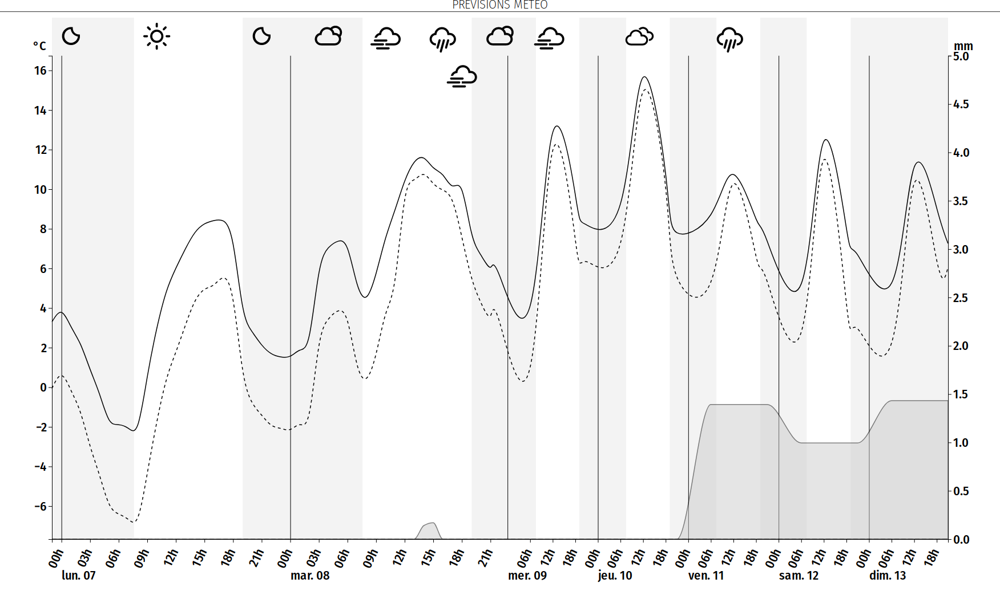

# MMM-WeatherChartD3

This is a module for the [MagicMirror²](https://github.com/MichMich/MagicMirror/).

This module displays a weather chart using any weather provider. It can display temperature, feels like temperature, precipitation, snow and weather icons.
It uses the [D3.js](https://d3js.org/) library.



## Using the module

To use this module, add the following configuration block to the modules array in the `config/config.js` file:

```js
var config = {
	modules: [
		{
			module: "MMM-WeatherChartD3",
			config: {
				updateInterval: 10 * 60 * 1000,
				initialLoadDelay: 0,
				weatherProvider: "openweathermap",
				weatherEndpoint: "/onecall",
				apiKey: "",
				type: "full", // Possible values: hourly, forecast (=daily) or specific value `full` which is a join of data from hourly+daily
				lang: config.language,
				lat: "",
				lon: "",
				units: config.units,
				locale: config.locale,
				d3jsVersion: "7", // can either be in format "7.4" or even "7.4.4"
				title: "Weather Forecast",
				height: 300,
				width: 500,
				iconSize: undefined, // in px or undefined to define automatically at first call
				iconURLBase: "https://raw.githubusercontent.com/erikflowers/weather-icons/master/svg/",
				hoursRatio: 0, // Ratio of fetched hours in graph (useful for openweathermap onecall that gives 48h with 1h precision) - 0 or undefined to ignore
				showIcons: true,
				showNights: true,
				showTemperature: true,
				showMinMaxTemperature: false,
				showFeelsLikeTemp: true,
				showPrecipitation: true,
				showPrecipitationProba: true, // Only used when showPrecipitation == true
				showSnow: true, // if false: snow is included in precipitations
				showPressure: true,
				showHumidity: true,
				showWind: true,
				showAQI: true,
				showUVI: true,
			}
		},
	]
}
```

## Installation

```sh
cd ~/MagicMirror/modules # Change path to modules directory of your actual MagiMirror² installation
git clone https://github.com/seb-ma/MMM-WeatherChartD3
cd MMM-WeatherChartD3
npm install --only=production
```

## Configuration

### Options

| Option					| Description
|-------------------------- |-------------
| `updateInterval`			| *Optional* How often does the content needs to be fetched? (Milliseconds)<br><br>**Type:** `int` (milliseconds)<br>Default 100000 milliseconds (10 minutes)
| `initialLoadDelay`		| *Optional* The initial delay before loading. If you have multiple modules that use the same API key, you might want to delay one of the requests. (Milliseconds)<br><br>**Type:** `int` (milliseconds)<br>Default 0 milliseconds
| `weatherProvider`			| *Optional* Which weather provider should be used.<br>see https://github.com/MichMich/MagicMirror/tree/master/modules/default/weather/providers for list of available providers
| `weatherEndpoint`			| *Optional* The openweathermap API endPoint.<br>Possible values: `/onecall`, `/forecast` (free users) or `/forecast/daily` (paying users or old apiKey only)<br>Default value: `/onecall`
| `type`					| *Optional* Which type of weather data should be displayed.<br>Possible values: `hourly`, `daily` or specific value `full` which is a join of data from `hourly`+`daily`<br>Default value: `full`
| `apiKey`					| *Required* API key to fetch the weather provider 
| `lat`						| *Required* Latitude of the location used for weather information.<br><br>**Type:** `float`
| `lon`						| *Required* Longitude of the location used for weather information.<br><br>**Type:** `float`
| `lang`					| *Optional* The language sent to provided.<br>Default value: uses value of `config.language`
| `units`					| *Optional* What units to use. Specified by config.js<br>Default value: uses value of `config.units`
| `locale`					| *Optional* The locale of the days.<br>Default value: uses value of `config.locale`
| `d3jsVersion`				| *Optional* The D3 version to use.<br>Default value: "7"<br>Can either be in format "7.4" or even "7.4.4"
| `height`					| *Optional* Height of the chart area.<br><br>**Type:** `int` (pixels)<br>Default value: 300
| `width`					| *Optional* Width of the chart area.<br><br>**Type:** `int` (pixels)<br>Default value: 500
| `iconSize`				| *Optional* Size of weather icons. Auto-define the maximum possible size that fits in chart if `undefined`<br><br>**Type:** `int` (pixels)<br>Default value: undefined
| `iconURLBase`				| *Optional* Base of the URL to retrieve icons<br> Default value: `https://raw.githubusercontent.com/erikflowers/weather-icons/master/svg/`
| `hoursRatio`				| *Optional* Ratio of fetched hours in graph (useful for openweathermap onecall that gives 48h with 1h precision) - 0 or undefined to ignore<br><br>**Type:** `float` (in [0 .. 1])<br>Default value: `0`
| `showIcons`				| *Optional* Show weather icons<br><br>**Type:** `boolean`<br>Default value: `true`
| `showNights`				| *Optional* Show a background color for nights<br><br>**Type:** `boolean`<br>Default value: `true`
| `showTemperature`			| *Optional* Show a plot with temperature for each day<br><br>**Type:** `boolean`<br>Default value: `true`
| `showMinMaxTemperature`	| *Optional* Show a plot with min and max temperature for each day (if given by provider)<br><br>**Type:** `boolean`<br>Default value: `false`
| `showFeelsLikeTemp`		| *Optional* Show a plot with the "feels like" temperature (if given by provider)<br><br>**Type:** `boolean`<br>Default value: `true`
| `showPrecipitation`		| *Optional* Show a plot with precipitations (if given by provider).<br><br>**Type:** `boolean`<br>Default value: `true`
| `showPrecipitationProba`	| *Optional* Show precipitations probability (if given by provider). Only displayed when `showPrecipitation` == `true`<br><br>**Type:** `boolean`<br>Default value: `true`
| `showSnow`				| *Optional* Show a plot with snow (if given by provider). Include snow in precipitations plot if set to `false`<br><br>**Type:** `boolean`<br>Default value: `true`
| `showHumidity`			| *Optional* Show a plot with humidity (if given by provider).<br><br>**Type:** `boolean`<br>Default value: `true`
| `showWind`				| *Optional* Show a plot with wind speed (if given by provider).<br><br>**Type:** `boolean`<br>Default value: `true`
| `showAQI`					| *Optional* Show Air Quality Index (if given by provider).<br><br>**Type:** `boolean`<br>Default value: `true`
| `showUVI`					| *Optional* Show UVI (if given by provider).<br><br>**Type:** `boolean`<br>Default value: `true`

### Styling

This chart can have a fully customized style.
Each item type have a specific class that can be overloaded in `custom.css`.